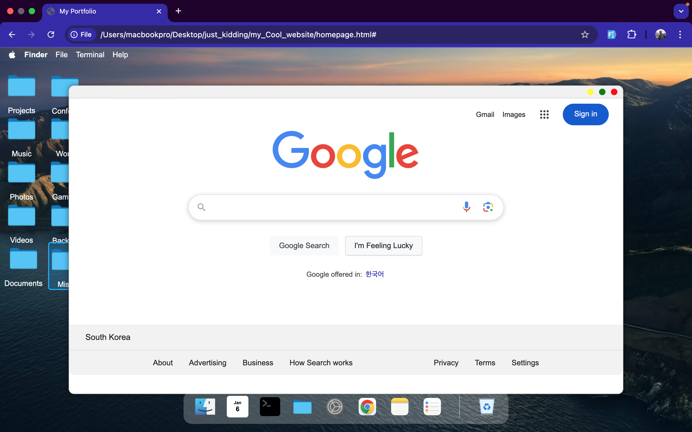
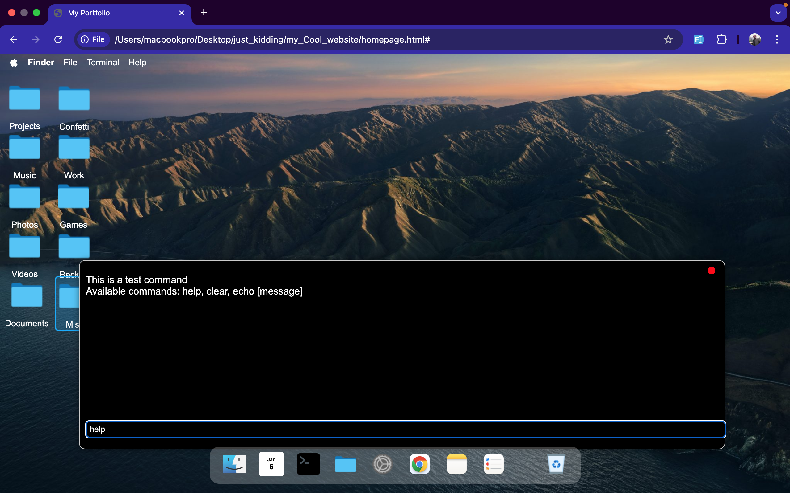
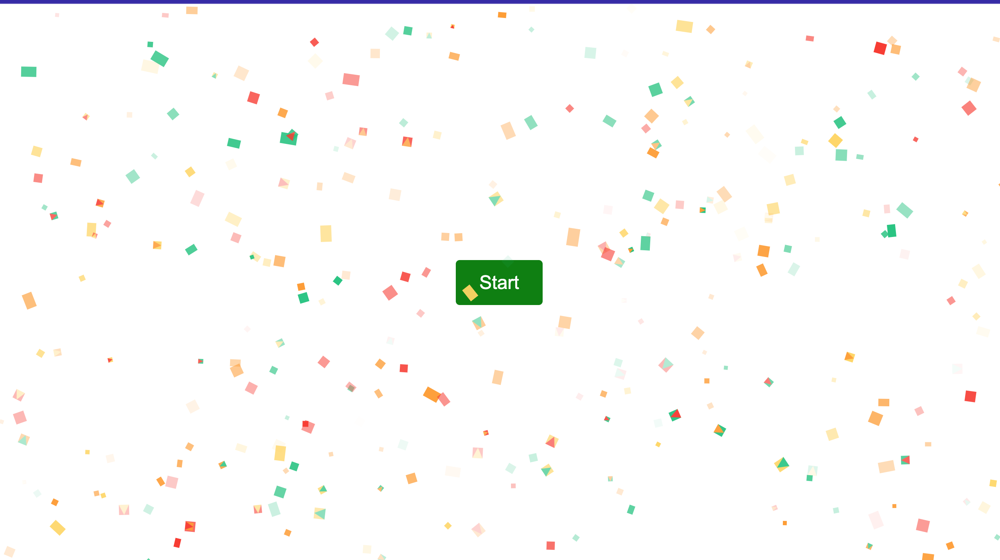

# My Portfolio

This project is a portfolio website that mimics the macOS homepage. It showcases multiple projects with interactive elements and a clean, modern design.

## Features

- **macOS Homepage Mimic**: The website design closely resembles the macOS homepage, providing a familiar and intuitive user experience.
- **Project Showcase**: Displays multiple projects with detailed descriptions, screenshots, and links to their respective repositories or live demos.
- **Interactive Elements**: Includes buttons, animations, and other interactive elements to enhance user engagement and experience.
- **Responsive Design**: The layout is optimized for various screen sizes and devices, ensuring a seamless experience on desktops, tablets, and mobile phones.

## Project Structure

```
my-portfolio
├── homepage.html      # The main HTML file containing the structure of the webpage
├── homepage.css       # The CSS file for styling the webpage
├── homepage.js        # The JavaScript file for interactive elements
└── README.md          # This documentation file
```

## How to Run the Webpage

1. Clone the repository or download the project files.
2. Open the `homepage.html` file in a web browser.
3. Explore the different sections and projects showcased on the webpage.

## Functionality

- The webpage mimics the macOS homepage layout, providing a familiar interface for users.
- Displays a list of projects with detailed descriptions, screenshots, and links to their respective repositories or live demos.
- Interactive elements such as buttons and animations enhance the user experience and engagement.
- The design is responsive, ensuring that the webpage looks great on all devices, including desktops, tablets, and mobile phones.

## Additional Information

- The design is inspired by the macOS homepage, offering a clean and modern look.
- Projects are showcased with detailed descriptions, screenshots, and links to their respective repositories or live demos.
- The interactive elements are implemented using JavaScript and CSS animations.

## Screenshots

### Homepage


### Google Search



### Terminal View



### Project Section

First:

